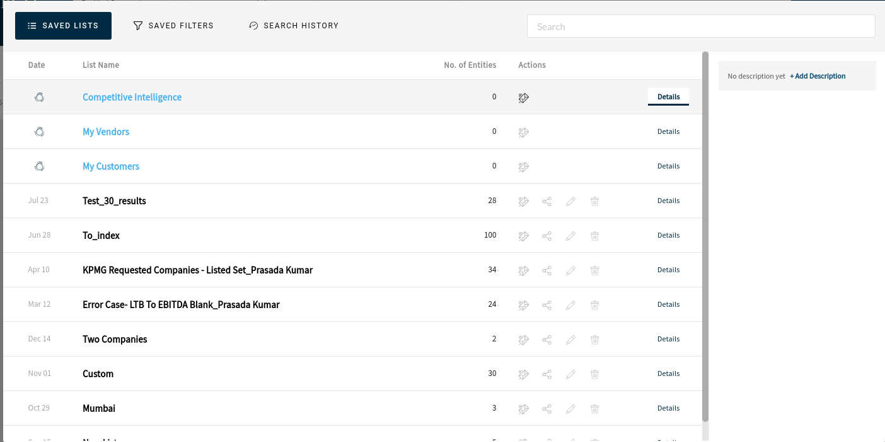
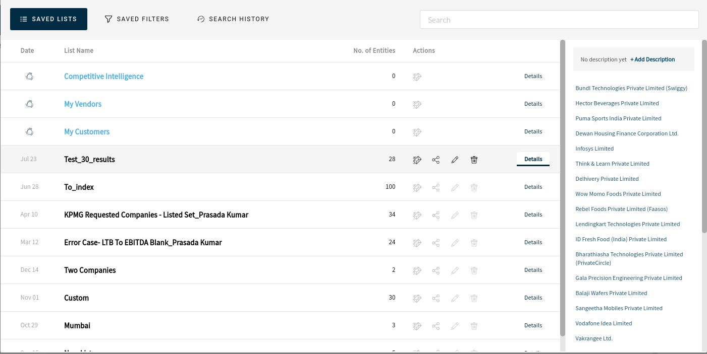
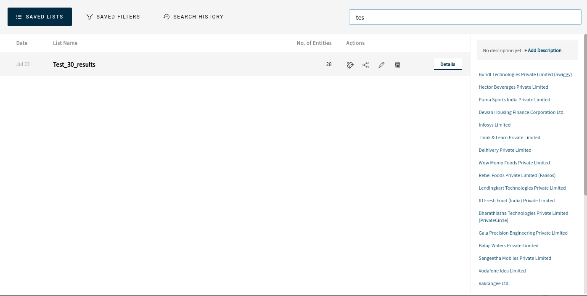

# Private Circle Angular Task

This project was generated with [Angular CLI](https://github.com/angular/angular-cli) version 12.1.1.

## Live Versin

Live Version of this app can be found [here](https://private-circle-task.vercel.app/)

Exlpore Code [here](https://github1s.com/B45i/pc-task/blob/HEAD/src/app/grid/grid.component.html)

## 3rd party Libraries

- ng-bootstrap
- Faker.js

Data is generated using a random data generation library called `faker.js`

Page reload will re-generate new data.

company names in the list is dynamic, as well as the `description` and the list below description.

## UI Mockups

